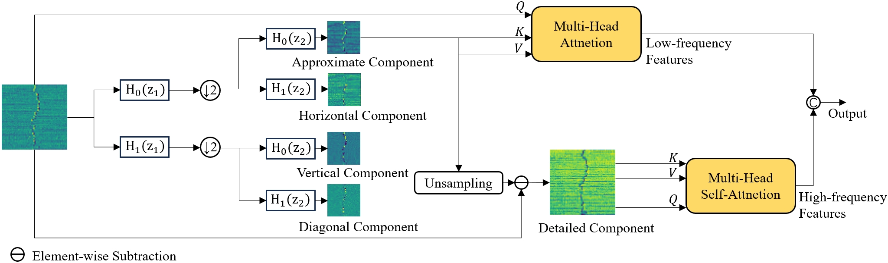
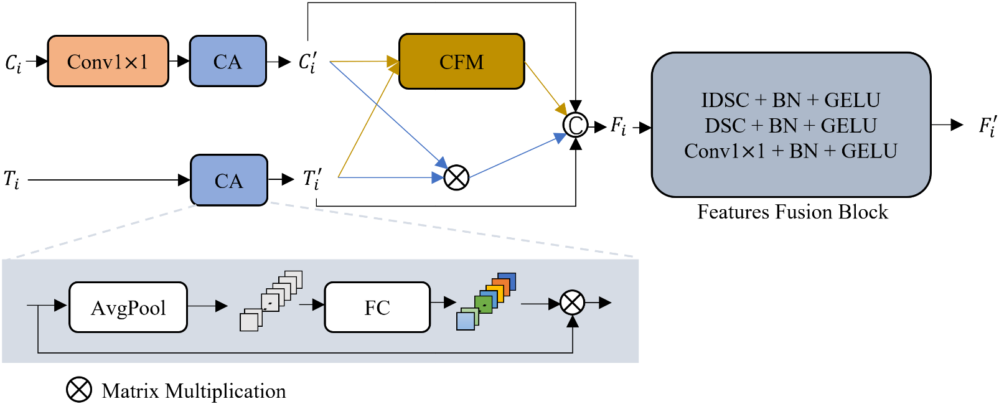

# DECS-Net: with Haar wavelet-based attention
We have made improvements based on [previous work](https://doi.org/10.1016/j.autcon.2023.105217):

<div align=center>

</div>

1. Treating the original input as a high-frequency component is arbitrary. Therefore, we first use **Haar wavelet decomposition** to obtain low-frequency components. Then upsample the low-frequency component and subtract it from the original input to obtain the high-frequency component.

<div align=center>

</div>

2. We have further improved the feature fusion module. Considering the issue of feature misalignment and mismatch, we first use a convolution to adjust. Then design cross-domain fusion module to perform deep fusion between features.

<div align=center>

</div>

For more details, please refer to our [paper](https://doi.org/10.1016/j.eswa.2024.124950). If you find our work helpful, please cite us:

```
@article{ZHANG2024124950,
title = {A dual encoder crack segmentation network with Haar wavelet-based high-low frequency attention},
journal = {Expert Systems with Applications},
pages = {124950},
year = {2024},
issn = {0957-4174},
doi = {10.1016/j.eswa.2024.124950},
author = {Jianming Zhang and Zhigao Zeng and Pradip Kumar Sharma and Osama Alfarraj and Amr Tolba and Jin Wang},
}
```
